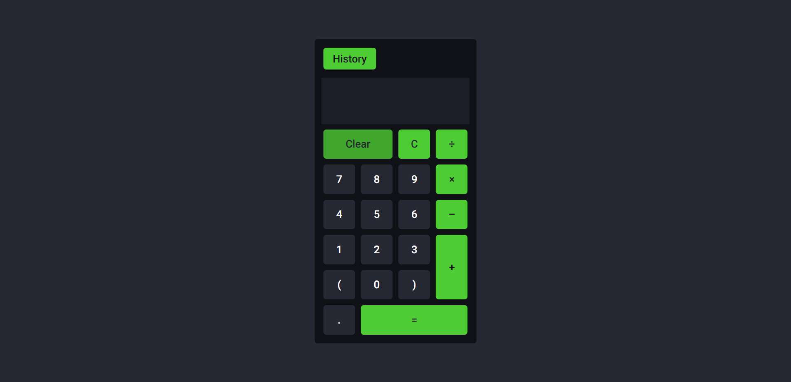

# Front-End para consumo da API de cálculo de expressões matemáticas

### Screenshot

### Screenshot - Mobile Version

  

### Construído com

-   React
-   Vite
-   JavaScript
-   TypeScript
-   Axios

A aplicação foi construída utilizando ReactJS com Typescript, por meio do Vite, com a
utilização de CSS puro para estilização.

Inicialmente é exibida uma tela com uma calculadora para realização de operações matemáticas, com parêntesis.

Há botões para limpar totalmente o display ("Clear") e para apagar apenas o último caractere inserido ("C").

Caso a operação seja inválida, é exibida a mensagem "Error" no display, sendo possível reiniciar o cálculo ao clicar em algum número.

Há o botão "History" que ao ser clicado redireciona o usuário para outra tela, com a listagem de todas as operações realizadas e persistidas no banco de dados, com indicação do ID, da expressão matemática realizada, do resultado e da data de operação.

Nesta página, também há um botão "Calculator" para redirecionar o usuário de volta para a tela da calculadora.

### Como utilizar

Para executar localmente, será preciso clonar o repositório e executar o comando 'npm
install' no terminal para instalar as dependências necessárias.

Após isso, é preciso executar 'npm run dev' no terminal para iniciar a aplicação,
sendo para isso necessário que a API esteja em execução.

## Autor

-   GitHub - Vinícius dos Santos Verissimo (https://github.com/viniciusdsv93)
